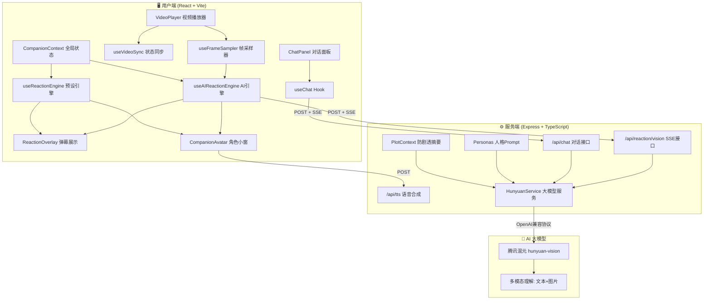

# AI 虚拟陪看 Reaction 技术链路文档

## 📋 概述

AI虚拟陪看Reaction是一款基于腾讯视频播放页的AI陪看产品原型，核心实现了**"AI先看视频 → 再生成陪看内容"**的沉浸式体验。系统通过实时视频帧采样 + 多模态大模型理解，让AI角色像真人朋友一样在观影过程中发出实时Reaction（弹幕/语音），并支持基于当前画面的自然语言对话。

---

## 🏗️ 系统架构



---

## 🔄 双模式运行机制

系统支持两种运行模式，通过后端健康检查接口 `/api/health` 自动切换：

### Demo 模式（离线演示）

```
触发条件: 后端未启动 或 health.mode === 'demo'
数据来源: 预设 SceneNode 剧情节点 JSON
引擎:      useReactionEngine
特点:      无需网络/AI，本地匹配时间轴触发
```

**工作流程：**
1. `PlayerPage` 检测到 Demo 模式
2. `useReactionEngine` 根据 `playerState.currentTime` 匹配预设节点
3. `reactionMatcher` 根据频率设置过滤触发
4. 直接展示弹幕 + 使用浏览器 Web Speech API 播报

### AI 模式（实时生成）

```
触发条件: 后端已启动 且 health.mode !== 'demo'
数据来源: 视频帧 → 混元多模态模型实时理解
引擎:      useAIReactionEngine + useFrameSampler
特点:      真实AI视觉理解，内容动态生成
```

**工作流程：**
1. `PlayerPage` 检测到 AI 模式
2. `useFrameSampler` 定时截取视频帧（Base64）
3. `useAIReactionEngine` 将帧送入后端 SSE 接口
4. 后端调用混元 Vision 模型实时生成 15 字以内弹幕
5. SSE 流式返回 → 前端实时展示

---

## 📊 核心数据流

### 一、Reaction 生成流（AI 模式）

```
┌─────────────────────────────────────────────────────────────────┐
│                    AI Reaction 完整数据流                          │
│              （含画面人物鉴别链路 v2）                               │
└─────────────────────────────────────────────────────────────────┘

[Video Element]
      │
      ▼ (每3秒采样一次)
[useFrameSampler]
      │ Canvas 截取 → 压缩至 512px 宽 → Base64
      ▼
[useAIReactionEngine]
      │ 累积 2~4 帧，达到间隔时间阈值
      ▼
[POST /api/reaction/vision]
      │ 请求体: { frames: base64[], persona, plotContext, settings }
      ▼
[后端 streamVisionReaction]
      │
      ▼ ========== 画面人物鉴别链路（新增） ==========
[detectCharacterInFrame]
      │ 输入: 最近 2 帧画面
      │ 模型: hunyuan-vision (temperature=0.1, 低温度确保稳定)
      │ Prompt: 判断画面是否有人物/角色
      │ 输出: { hasCharacter: boolean, description: string }
      │
      ├─── hasCharacter = false ──→ 直接返回 [SKIP]，不生成任何内容
      │     (纯风景、空镜、特效过渡、建筑远景等)
      │
      └─── hasCharacter = true ──→ 继续下一步
      │
      ▼ ========== 正常 Reaction 生成流程 ==========
[buildVisionReactionPrompt]
      │ 拼装: System Prompt + 人格 + 防剧透摘要 + 剧本进度
      ▼
[callHunyuanVisionStream]
      │ 调用 OpenAI 兼容 API (stream: true)
      │ Model: hunyuan-vision
      │ 输入: 文本 prompt + 视频帧图片 + 剧情上下文
      ▼
[混元 Vision 多模态模型]
      │ 结合剧本内容和当前进度，判断是否值得输出
      │ 输出: ≤15字弹幕文本 或 [SKIP]
      ▼
[SSE 流式返回]
      │ data: {"content":"..."}
      ▼
[前端解析 & 展示]
      ├─→ ReactionOverlay (弹幕气泡)
      ├─→ CompanionAvatar (情绪动画)
      └─→ TTS 语音播报 (可选)
```

#### 画面人物鉴别链路详解

**目的**：解决 AI 在纯风景/空镜头画面时仍大量输出"画面太美了"、"仙侠剧天花板"等无意义 Reaction 的问题。

**设计原则**：
- 画面中**没有人物** → 不输出任何内容（大幅减少噪音）
- 画面中**有人物** → 结合剧本内容和当前播放进度，由 AI 决定是否值得发出 Reaction

**判断逻辑**：
| 画面类型 | hasCharacter | 后续行为 |
|---------|-------------|---------|
| 人物对话、互动 | ✅ true | 进入正常 Reaction 生成 |
| 角色特写、表情 | ✅ true | 进入正常 Reaction 生成 |
| 打斗、动作场面 | ✅ true | 进入正常 Reaction 生成 |
| 纯风景、山水空镜 | ❌ false | 直接 [SKIP] |
| 特效过渡画面 | ❌ false | 直接 [SKIP] |
| 建筑/场景全景（无人） | ❌ false | 直接 [SKIP] |

**API 端点**：
- `POST /api/reaction/detect-character` — 独立的人物鉴别接口（可用于调试）
- 请求体: `{ frames: string[] }`
- 响应: `{ hasCharacter: boolean, description: string }`

**Demo 模式**：
- 模拟真实仙侠剧的人物/空镜比例（约 70% 有人物，30% 空镜）
- 通过计数器周期性返回"无人物"结果，模拟空镜过滤效果

### 二、对话流（视觉增强）

```
[用户输入消息]
      │
      ▼
[useChat Hook]
      │ 获取 CompanionContext.latestFrame (当前画面)
      ▼
[POST /api/chat]
      │ 请求体: { message, persona, latestFrame?, history }
      ▼
[后端 chat.ts 路由]
      │ 构建多轮对话上下文 + 视频帧(如有)
      ▼
[HunyuanService]
      │ 调用混元模型 (stream: true)
      ▼
[SSE 流式返回]
      │ 逐字回传 AI 回复
      ▼
[ChatPanel 实时渲染]
```

### 三、预设 Reaction 流（Demo 模式）

```
[playerState.currentTime 更新]
      │
      ▼
[useReactionEngine]
      │ 调用 matchReactionNodes()
      │ 匹配: 当前时间 ∈ [node.timestamp, node.timestamp + tolerance]
      │ 过滤: 频率控制 (high/medium/low 对应不同跳过策略)
      │ 去重: triggeredIdsRef 防止重复触发
      ▼
[addReaction]
      │ 创建 ActiveReaction 对象
      ├─→ setActiveReactions 更新弹幕队列
      └─→ speechQueueRef 语音队列 → Web Speech API
```

---

## 🧩 关键技术模块

### 1. 视频帧采样器 (`useFrameSampler`)

```typescript
核心职责: 定时从 <video> 元素截取画面帧，输出 Base64

关键参数:
- interval: 3秒（采样间隔）
- maxFrames: 4（最大保留帧数）
- quality: 0.6（JPEG 压缩质量）
- outputWidth: 512（输出宽度，等比缩放）

技术实现:
1. 创建离屏 Canvas
2. drawImage 绘制当前视频帧
3. canvas.toDataURL('image/jpeg', quality) 导出
4. 维护帧缓冲区（FIFO 队列）
5. 暴露 latestFrame 供对话使用
```

### 2. AI Reaction 引擎 (`useAIReactionEngine`)

```typescript
核心职责: 定时将帧送入后端，解析 SSE 响应，管理 AI Reaction 队列

工作机制:
1. 监听帧更新，累积到阈值触发
2. 构建请求: frames + persona + reactionInterval
3. 发起 SSE 请求（EventSource/fetch stream）
4. 解析响应中的 reaction text + emotion
5. 创建 ActiveReaction 推入展示队列
6. 管理情绪状态转换（neutral → happy → surprised...）
7. 控制请求频率，避免并发堆积
```

### 3. 预设 Reaction 引擎 (`useReactionEngine`)

```typescript
核心职责: 根据播放进度匹配预设剧情节点，触发 Reaction

匹配算法 (reactionMatcher.ts):
1. 遍历 SceneNode 列表
2. 检查: |currentTime - node.timestamp| < tolerance(1秒)
3. 频率控制: high=全触发, medium=跳1个, low=跳2个
4. 记录已触发 ID 到 Set，防止重复
5. 快进/后退时重置触发状态

语音播报:
- 使用浏览器原生 SpeechSynthesis API
- 维护语音队列，逐条播报
- 支持暂停/恢复（跟随视频状态）
```

### 4. 人格化 Prompt 系统 (`personas.ts`)

```typescript
五种角色人格:
┌──────────────────────────────────────────────────────────────┐
│ 角色          │ 风格定位          │ 典型反应                    │
├──────────────────────────────────────────────────────────────┤
│ 剧情探索家    │ 细节分析型        │ "这个伏笔太妙了！"          │
│ 共情小天使    │ 情感共鸣型        │ "好心疼她啊..."            │
│ 吐槽导演      │ 幽默吐槽型        │ "导演你是不是偷懒了？"      │
│ 毒舌观察员    │ 犀利评价型        │ "主角光环开到最大了吧"      │
│ 时间管理大师  │ 节奏把控型        │ "这段可以两倍速了"          │
└──────────────────────────────────────────────────────────────┘

Prompt 构成:
1. System: 角色设定 + 输出格式约束(≤15字)
2. Context: 防剧透剧情摘要（仅到当前进度）
3. User: [图片帧] + "请根据画面生成一条弹幕"
```

### 5. 防剧透机制

```
原理:
- 后端维护剧集时间轴的分段摘要
- 根据请求携带的 currentTime，仅提供 ≤ 当前时间的剧情信息
- AI 模型在 System Prompt 中被约束"不得提及后续剧情"
- 确保 Reaction 内容严格基于"已看到的画面"

实现:
1. plotNodes.json 存储分段剧情摘要 { timestamp, summary }
2. 请求时过滤: nodes.filter(n => n.timestamp <= currentTime)
3. 拼接为 plotContext 注入 prompt
```

### 6. SSE 流式通信

```
协议: Server-Sent Events (text/event-stream)

前端:
- fetch() + ReadableStream 读取
- TextDecoder 解码 UTF-8 chunk
- 逐行解析 "data: {json}" 格式
- 支持 "data: [DONE]" 终止信号

后端:
- res.setHeader('Content-Type', 'text/event-stream')
- res.setHeader('Cache-Control', 'no-cache')
- 调用混元 API stream 模式
- 逐 token 写入 res.write(`data: ${JSON.stringify(chunk)}\n\n`)

优势:
- 延迟极低（首字 < 500ms）
- 无需 WebSocket 复杂连接管理
- 天然支持单向数据推送
```

---

## ⚡ 性能优化策略

### 前端优化

| 策略 | 实现 |
| --- | --- |
| 帧采样节流 | 3秒间隔，避免频繁 Canvas 操作 |
| 图片压缩 | 512px 宽 + JPEG 0.6 质量，单帧 < 50KB |
| 弹幕过期清理 | 定时器每 500ms 清理超时 Reaction |
| 依赖稳定化 | useRef 存储回调，避免 useEffect 频繁重执行 |
| 语音队列化 | 逐条播报，避免并发 TTS |
| React.memo | 关键组件记忆化，减少不必要重渲染 |
| 动画 GPU 加速 | transform/opacity 动画，不触发重排 |

### 后端优化

| 策略 | 实现 |
| --- | --- |
| 流式响应 | SSE 逐 token 推送，首字延迟 < 500ms |
| Prompt 精简 | 约束输出 ≤15字，减少 token 消耗 |
| 上下文窗口 | 仅传最近 4 帧，控制 Vision 输入成本 |
| 防剧透裁剪 | 按时间过滤摘要，减少无关 token |
| 错误重试 | API 调用失败自动重试 1 次 |
| 健康检查 | /api/health 快速响应模式判断 |

---

## 🔧 技术栈总览

```
┌────────────────────────────────────────────────┐
│                 前端技术栈                        │
├────────────────────────────────────────────────┤
│ 框架:       React 18 + TypeScript              │
│ 构建:       Vite 5                             │
│ 样式:       Tailwind CSS 3.4 + CSS 变量        │
│ 动效:       Framer Motion 11                   │
│ 拖拽:       react-draggable                    │
│ 状态:       React Context + Hooks              │
│ 视频:       HTML5 Video API                    │
│ 语音:       Web Speech API (Demo)              │
│ 通信:       Fetch API + ReadableStream (SSE)   │
└────────────────────────────────────────────────┘

┌────────────────────────────────────────────────┐
│                 后端技术栈                        │
├────────────────────────────────────────────────┤
│ 运行时:     Node.js 18+                        │
│ 框架:       Express 4                          │
│ 语言:       TypeScript 5                       │
│ AI SDK:     OpenAI Node SDK (兼容协议)         │
│ 模型:       腾讯混元 hunyuan-vision            │
│ 通信:       SSE (Server-Sent Events)           │
│ TTS:        腾讯云语音合成 (可选)              │
└────────────────────────────────────────────────┘
```

---

## 📁 核心文件索引

| 文件 | 职责 |
| --- | --- |
| `client/src/components/Layout/PlayerPage.tsx` | 主页面，协调所有模块 |
| `client/src/components/VideoPlayer/VideoPlayer.tsx` | 视频播放器 + 控制栏 |
| `client/src/components/AiCompanion/CompanionAvatar.tsx` | 虚拟角色小窗 |
| `client/src/components/AiCompanion/ReactionBubble.tsx` | Reaction 气泡组件 |
| `client/src/components/AiCompanion/ReactionOverlay.tsx` | 弹幕覆盖层 |
| `client/src/components/ChatPanel/ChatPanel.tsx` | 对话面板 |
| `client/src/hooks/useFrameSampler.ts` | 视频帧定时采样 |
| `client/src/hooks/useAIReactionEngine.ts` | AI Reaction 核心引擎 |
| `client/src/hooks/useReactionEngine.ts` | 预设 Reaction 引擎 |
| `client/src/hooks/useChat.ts` | 对话 Hook (SSE) |
| `client/src/hooks/useVideoSync.ts` | 播放状态同步 |
| `client/src/services/api.ts` | API 服务封装 |
| `client/src/services/reactionMatcher.ts` | 预设节点时间匹配 |
| `client/src/contexts/CompanionContext.tsx` | 全局状态管理 |
| `server/src/routes/reaction.ts` | Reaction SSE 路由 |
| `server/src/routes/chat.ts` | 对话 SSE 路由 |
| `server/src/services/hunyuan.ts` | 混元大模型调用 |
| `server/src/prompts/personas.ts` | 人格化 Prompt 模板 |

---

## 🎯 产品特色总结

1. **"先看后评" 体验**：AI 真正"看到"视频画面后才发表评论，而非预设脚本
2. **画面人物鉴别**：智能识别画面是否有角色出现，纯风景/空镜直接跳过，避免无意义输出
3. **人格化 Reaction**：5种角色人格，同一画面产生完全不同风格的弹幕
4. **防剧透设计**：严格基于已播放内容生成评论，绝不泄露后续剧情
5. **双模式兼容**：有网络调AI，无网络用预设，体验无缝切换
6. **多形态输出**：弹幕 + 语音 + 字幕三种呈现形式自由组合
7. **低延迟交互**：SSE 流式通信 + 帧采样优化，首字响应 < 500ms
8. **视觉增强对话**：聊天时自动附带当前画面，AI 能"看图说话"
